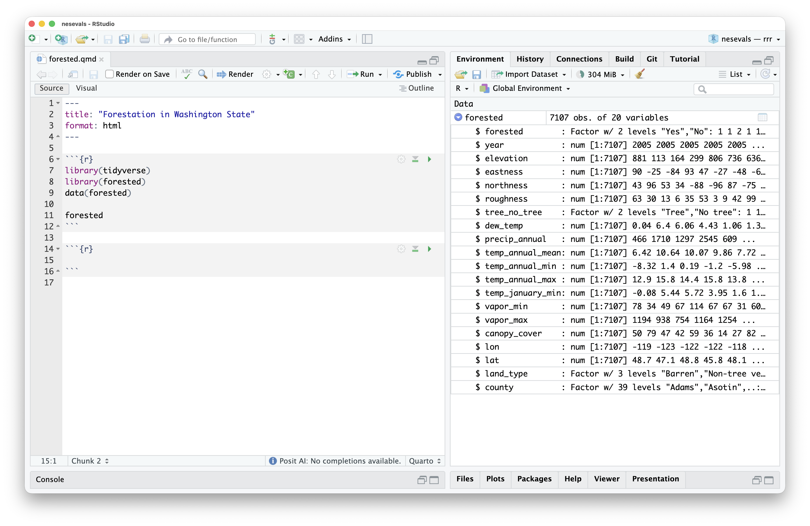

```{r}
#| label: setup
#| include: false
options(ellmer_timeout_s = 1000)

options(width = 70)

knitr::opts_chunk$set(
  fig.width = 6, 
  fig.asp = 0.618, 
  out.width = "100%", 
  message = FALSE, 
  warning = FALSE
)

source("../common.R")

theme_update(
  plot.subtitle = element_text(face = "italic"),
  text = element_text(size = 10)
)

cat <- function(x, width = 0.9 * getOption("width")) {
  lines <- unlist(strsplit(x, "\n"))
  wrapped <- unlist(lapply(lines, strwrap, width = width))
  base::cat(wrapped, sep = "\n")
}

# use this to resize the thumbnail image for the blog post
optimize_image <- function(
	image_path, 
	target_width = 500, 
	target_quality = 85, 
	output_format = "png"
  ) {
  img <- magick::image_read(image_path)
  
  dims <- magick::image_info(img)
  
  if (dims$width > target_width) {
    img <- magick::image_resize(img, paste0(target_width, "x"))
  }
  
  img <- magick::image_write(
	img, image_path, format = output_format, quality = target_quality
  )
  
  invisible(img)
}
```

```{=html}
<style>
.no-shadow img {
  border-radius: 0 !important;
  box-shadow: none !important;
}
.page-full:has(.cr-section) > :not(.cr-section):not(.page-full) {
  grid-column: page-start / page-end !important;
}
</style>
```

I just loaded some data from the [forested package](https://simonpcouch.github.io/forested/) into my R environment. It has a bunch of measurements of forest attributes across Washington State:

```{r}
#| fig-alt: A screenshot of an RStudio window. In the left-hand side, I load the tidyverse and forested packages, and from the forested package, I load the dataset forested. On the right-hand side, we see the column names for the forested dataset Inside of the environment tab.
#| classes: no-shadow

```

Let's add a lon/lat plot of the data to this Quarto document:



In this video, I'm often just typing a couple characters and then waiting for Next Edit Suggestions (NES), part of our new  [Posit AI](https://posit.ai) service. You might notice a couple things:

1) It doesn't hallucinate dataset or column names.
2) It doesn't f*** up the formatting of the Quarto document.
3) The suggestions arrive _very_ quickly.
4) Broadly, the suggestions are quite reasonable.

At this point, 3) and 4) are table stakes for IDE next edit suggestions (aka supercomplete or AI autocomplete). 1) and 2), though, will be quite unfamiliar to those who have used NES in other IDEs before. I'm going to write a bit about how this system works and how it came to be.

<!-- While there's definitely more work to do, I'm really happy with how this initial release of Next Edit Suggestions shook out. -->

## Table stakes: reasonable suggestions at blistering speed

Loosely, IDEs' Next Edit Suggestions features look like this:

* Rent out a GPU and put a small  (8B or so) model on it.
* As your users type, take a snapshot of the file every few seconds and record the changes to generate an "edit history."
* On request (either automatically after some typing delay or through an explicit request from a keyboard command), provide the state of the file as well as some log of those edits to the model. A few thousand input tokens.
* Have the model reply with the change that it wants to make. Output formats vary here, but usually a couple hundred output tokens.

Now, which small model do you use? How do you present the "edit history" to that model? How do you combine all of those pieces of the prompt together? How does the model specify the output format?

To help us answer this question, I put together an open-source evaluation called [nesevals](https://github.com/posit-dev/nesevals/). Structured as an R package, the eval allowed us to try out a bunch of different models, input formats, and output formats. The raw data is available in the package, but we'll walk through a plot that condenses a lot of the lessons learned onto two axes.

```{r plot-setup, message = FALSE, warning = FALSE, echo = FALSE}
library(nesevals)
library(ggplot2)
library(ggrepel)
library(ggforce)

qwen_cluster <- nes_results |>
  dplyr::filter(model == "qwen3-8b", median_latency_ms < 200, mean_score < 3.5)

qwen_cluster_2 <- nes_results |>
  dplyr::filter(model == "qwen3-8b", median_latency_ms > 200)

label_data <- nes_results |>
  dplyr::filter(model %in% c("claude-haiku-4-5-20251001", "openai/gpt-oss-20b", "qwen3-8b", "zeta",
                              "gpt-4.1-nano-2025-04-14", "gpt-5-nano", "llama3.1-8b", "gemini-3.1-flash-lite-preview")) |>
  dplyr::slice_max(mean_score, by = model, n = 1) |>
  dplyr::mutate(label = dplyr::case_when(
    model == "claude-haiku-4-5-20251001" ~ "Claude Haiku 4.5 (Anthropic)",
    model == "openai/gpt-oss-20b"        ~ "GPT-OSS 20B (Groq)",
    model == "qwen3-8b"                  ~ "Qwen3-8B (Baseten)",
    model == "zeta"                      ~ "Zeta (Baseten)",
    model == "gpt-4.1-nano-2025-04-14"  ~ "GPT-4.1 Nano (OpenAI)",
    model == "gpt-5-nano"               ~ "GPT-5 Nano (OpenAI)",
    model == "llama3.1-8b"              ~ "Llama 3.1-8B (Cerebras)",
    model == "gemini-3.1-flash-lite-preview"    ~ "Gemini 3.1 Flash-Lite (Google)"
  ))

hull_label <- data.frame(
  median_latency_ms = max(qwen_cluster$median_latency_ms),
  mean_score        = mean(qwen_cluster$mean_score),
  label             = "Other Qwen3-8B\nscaffolds (Baseten)"
)

hull_label_2 <- data.frame(
  median_latency_ms = mean(qwen_cluster_2$median_latency_ms),
  mean_score        = mean(qwen_cluster_2$mean_score)
)

nes_plot <- function(focus = "all") {
  fade <- "grey80"
  black <- "black"

  focused_models <- switch(focus,
    "frontier"    = c("claude-haiku-4-5-20251001", "gpt-4.1-nano-2025-04-14", "gpt-5-nano", "gemini-3.1-flash-lite-preview"),
    "boutique"    = c("openai/gpt-oss-20b", "llama3.1-8b"),
    "baseten"     = c("qwen3-8b", "zeta"),
    "zeta"        = c("zeta"),
    "qwen-other"  = c("qwen3-8b"),
    "qwen-winner" = c("qwen3-8b"),
    NULL
  )


  qwen_winner_rows <- nes_results |>
    dplyr::filter(model == "qwen3-8b") |>
    dplyr::slice_max(mean_score, n = 1)

  pt_data <- nes_results |>
    dplyr::mutate(
      is_winner = model == "qwen3-8b" &
        median_latency_ms == qwen_winner_rows$median_latency_ms[1] &
        mean_score == qwen_winner_rows$mean_score[1],
      focused = dplyr::case_when(
        focus == "all" ~ TRUE,
        focus == "qwen-winner" ~ is_winner,
        focus == "qwen-other" ~ model == "qwen3-8b" & !is_winner,
        TRUE ~ model %in% focused_models
      ),
      pt_color = ifelse(focused, black, fade)
    )

  lbl_data <- label_data |>
    dplyr::mutate(
      focused = dplyr::case_when(
        focus == "all" ~ TRUE,
        focus == "qwen-winner" ~ model == "qwen3-8b",
        focus == "qwen-other" ~ FALSE,
        TRUE ~ model %in% focused_models
      ),
      lbl_color = ifelse(focused, black, fade)
    )

  hull1_color <- if (focus %in% c("all", "baseten", "qwen-other")) black else fade
  hull2_color <- if (focus %in% c("all", "baseten", "qwen-other")) black else fade
  if (focus == "qwen-winner") {
    hull1_color <- fade
    hull2_color <- fade
  }
  hull_lbl_color <- if (focus %in% c("all", "baseten", "qwen-other")) black else fade
  hull_lbl <- hull_label |>
    dplyr::mutate(lbl_color = hull_lbl_color)

  set.seed(9598)

  p <- ggplot(pt_data) +
    aes(x = median_latency_ms, y = mean_score) +
    geom_mark_hull(
      data = qwen_cluster,
      expand = unit(3, "mm"),
      color = hull1_color,
      fill = NA
    ) +
    geom_mark_hull(
      data = qwen_cluster_2,
      expand = unit(3, "mm"),
      color = hull2_color,
      fill = NA
    ) +
    geom_point(aes(color = pt_color)) +
    scale_color_identity() +
    geom_text_repel(
      data = lbl_data,
      aes(label = label, color = lbl_color),
      max.overlaps = 20
    ) +
    geom_text_repel(
      data = hull_lbl,
      aes(label = label, color = lbl_color),
      nudge_x = 400,
      segment.curvature = -0.1,
      segment.color = hull_lbl_color
    ) +
    geom_curve(
      data = hull_label_2,
      aes(
        xend = median_latency_ms * 0.85 + (max(qwen_cluster$median_latency_ms) + 400) * 0.15,
        yend = mean_score * 0.85 + mean(qwen_cluster$mean_score) * 0.15
      ),
      x = mean(qwen_cluster_2$median_latency_ms) * 0.4 + (max(qwen_cluster$median_latency_ms) + 400) * 0.5,
      y = mean(qwen_cluster_2$mean_score) * 0.5 + mean(qwen_cluster$mean_score) * 0.5,
      curvature = 0,
      linewidth = 0.5,
      color = hull_lbl_color
    ) +
    labs(
      title = "NES Scaffold Performance vs. Latency",
      x = "Median Latency (ms)",
      y = "Mean Model-Graded Quality Score"
    ) +
    expand_limits(x = 0)

  p
}
```

:::{.cr-section}

Each point is one scaffold---a combination of model and prompt format. The x-axis is median latency; the y-axis is a model-graded quality score. We want the top-left corner: fast and good. @cr-plot-all

The first thing you might reach for is the fastest model on a frontier lab's API. Claude Haiku 4.5, Gemini 3.1 Flash-Lite, GPT-4.1 Nano, and GPT-5 Nano all score reasonably well---but their latency is far too high for real-time suggestions. @cr-plot-frontier

Even Gemini 3.1 Flash-Lite, the fastest of them, takes over a second per suggestion. [@cr-plot-frontier]{highlight="1"}

Moving left, a few inference-focused providers like Groq and Cerebras serve open models at better latencies. @cr-plot-boutique

GPT-OSS 20B on Groq scores well, but ~550ms is still too slow for a feature that fires every couple of seconds. @cr-plot-boutique

On the far left, many under 200ms, are our custom deployments on Baseten. @cr-plot-baseten

At the very bottom is Zeta, a fine-tune from the Zed team. The latency was great, but the model wasn't resilient to our inclusion of variable metadata in the prompt. @cr-plot-zeta

The remaining points are all Qwen3-8B with different input formats. The two clusters reflect different prompt scaffolds. @cr-plot-qwen-other

That brings us to the winner---the top-left point. This is the scaffold deployed as part of the service. @cr-plot-qwen-winner

:::{#cr-plot-all}
```{r}
#| echo: false
#| out-width: "80%"
#| fig-align: center
#| fig-alt: "A scatter plot titled 'NES Scaffold Performance vs. Latency'. The x-axis shows median latency in milliseconds starting at 0, and the y-axis shows mean model-graded quality score."
nes_plot("all")
```
:::

:::{#cr-plot-frontier}
```{r}
#| echo: false
#| out-width: "80%"
#| fig-align: center
nes_plot("frontier")
```
:::

:::{#cr-plot-boutique}
```{r}
#| echo: false
#| out-width: "80%"
#| fig-align: center
nes_plot("boutique")
```
:::

:::{#cr-plot-baseten}
```{r}
#| echo: false
#| out-width: "80%"
#| fig-align: center
nes_plot("baseten")
```
:::

:::{#cr-plot-zeta}
```{r}
#| echo: false
#| out-width: "80%"
#| fig-align: center
nes_plot("zeta")
```
:::

:::{#cr-plot-qwen-other}
```{r}
#| echo: false
#| out-width: "80%"
#| fig-align: center
nes_plot("qwen-other")
```
:::

:::{#cr-plot-qwen-winner}
```{r}
#| echo: false
#| out-width: "80%"
#| fig-align: center
nes_plot("qwen-winner")
```
:::

:::

<br><br><br><br>

## A close read

We'll walk through what one Next Edit Suggestion looks like using this `forested` example. With NES turned to "Automatic", these are firing off every second or two as I type.

:::{.cr-section}

The system prompt is pretty minimal. @cr-system-intro

The "default" behavior of these models is to omit portions of the code that they're not editing. [@cr-system-intro]{highlight="8-10"}

:::{#cr-system-intro .scale-to-fill}
``````markdown
You are a code completion assistant. You will be given a
file excerpt for context and a region from that excerpt
to rewrite. Predict the user's next edit by rewriting
only the provided region.

Output the rewritten region wrapped in a code fence 
using exactly 5 backticks. Remove any cursor markers. 
Your output replaces the region entirely, so any line you 
omit will be deleted. Always reproduce the full region,
including lines you did not change.
``````
:::

:::

<br><br>

The system prompt also includes a worked example; instead of repeating it here, we'll just talk through the same sections that appear in the user prompt.

<br><br><br>

The user prompt is composed of four sections:

1) **File context**, showing a large portion of the document the user is editing.
2) The **edit history**, displaying the edits they've recently made to the document.
3) **Variables** from the user's active computational session.
4) The **region** to apply an edit inside of. This is 5 lines before and after the user's cursor maximum.

<br><br>

:::{.cr-section}

The file context provides a long excerpt from the file that the user is editing. @cr-file-context

We always use 5 backticks as code fences so that we can include triple backticks from Quarto / RMarkdown / Markdown documents without issue. [@cr-file-context]{highlight="5"}

We use 5 backticks rather than some other delineator as a way of "swimming downstream" with LLMs' default behavior. Models usually want to start code cells with triple backticks; with other dilineators, if the model accidentially started with triple backticks, the response had to be thrown away. [@cr-file-context]{highlight="5"}

The user's cursor is marked with a `<cursor>` tag. [@cr-file-context]{highlight="15"}

The next piece of the user prompt is the edit history. @cr-edit-history

Our initial reflex was that the most intuitive way to show edits would be diffs. e.g., inside of an excerpt, a code cell with + on the lines added and - on the lines deleted. [@cr-edit-history]{highlight="11-17"}

In evals, I found that this was not actually the case. I call this edit history format a "narrative" format, where we post-process the edits to situate them in natural language. Models seem to "see" the changes much better this way. [@cr-edit-history]{highlight="11-17"}

We only include one line of file context around the changes on either side. [@cr-edit-history]{highlight="11-17"}

I don't know why it works, but one hypothesis is that it says what happened—the important part—twice: first in the narrative, second in the resulting code cell. [@cr-edit-history]{highlight="19-26"}

The "real" version of this edit history includes many more edits--up to 10. [@cr-edit-history]{highlight="19-26"}

The prompt also includes metadata on the variables present in the user's R or Python environment. @cr-variables

Here, the model can see every column name and type in the `forested` data frame. [@cr-variables]{highlight="5-23"}

This is just enough information to write code to work the data and nothing more. Notably, we don't include the _values_ of columns or other variables in the session. [@cr-variables]{highlight="5-23"}

We use a few heuristics to determine which variables to show in this part of the prompt, but broadly, if it's in the file excerpt, metadata on it will appear here. [@cr-variables]{highlight="5-23"}

This is how the model knows to suggest `canopy_cover`. Without this information, it would have to make a column name up; other NES systems do this regularly with data science code. [@cr-variables]{highlight="17-19"}

Finally, the prompt specifies exactly which lines the model should
rewrite. @cr-region

Note that this is a much smaller excerpt than 5 lines above and below the cursor. Since we're in a Quarto document here, we use a different heuristic. [@cr-region]{highlight="6-10"}

Even frontier models like Claude Opus 4.6 have trouble outputting code with mismatched backticks. It's possible that, if we had just taken some fixed number of lines above and below the cursor, there'd be code fences without a "match" in the region. If the model mistakenly adds or removes them, that'd be processed as a proposed edit and, if accepted, botch the Quarto formatting. [@cr-region]{highlight="6-10"}

Instead, we start at the cursor and "walk" in either direction. If we hit code fences, we stop. [@cr-region]{highlight="7-9"}

This way, the model is never asked to output mismatched code fences. This works quite well. @cr-region

:::{#cr-file-context .scale-to-fill}
``````markdown
## File context

Here is the code the user is currently editing.

`````file
```{{r}}
library(tidyverse)
library(forested)

forested
```

```{{r}}
ggplot(forested) +
  aes(x = lon, y = lat, <cursor>) +
  geom_point(size = .4)
```
`````
``````
:::

:::{#cr-edit-history .scale-to-fill}
``````markdown
## Edit History

The following edits led to the current state of the file.

The user's code started like this:

`````
ggplot(forested)
`````

Then, the user added 2 lines:

`````
ggplot(forested) +
  aes(x = lon, y = lat) +
  geom_point(size = .4)
`````

Most recently, the user changed `aes(x = lon, y = lat) +`
to `aes(x = lon, y = lat, ) +`:

`````
ggplot(forested) +
  aes(x = lon, y = lat, ) +
  geom_point(size = .4)
`````
``````
:::

:::{#cr-variables .scale-to-fill}
``````markdown
## Variables

The following variables are present in the user's computational environment:

forested: <data.frame>
 forested$forested: <numeric>
 forested$year: <numeric>
 forested$elevation: <numeric>
 forested$eastness: <numeric>
 forested$northness: <numeric>
 forested$roughness: <numeric>
 forested$tree_no_tree: <numeric>
 forested$dew_temp: <numeric>
 forested$precip_annual: <numeric>
 forested$vapor_min: <numeric>
 forested$vapor_max: <numeric>
 forested$canopy_cover: <numeric>
 forested$lon: <numeric>
 forested$lat: <numeric>
 forested$land_type: <numeric>
 forested$county: <numeric>
``````
:::

:::{#cr-region .scale-to-fill}
``````markdown
## Region

Rewrite the following region from the excerpt above to
predict the user's next edit:

`````file
ggplot(forested) +
  aes(x = lon, y = lat, <cursor>) +
  geom_point(size = .4)
`````
``````
:::

:::

<br><br><br>

We send that all off to the model and, hopefully, get a rewritten version of the excerpt in reply.

<br><br><br>

:::{.cr-section}

The model suggests `color = canopy_cover`. [@cr-assistant]{highlight="3"}

That will be post-processed by the NES extension and, since it's a single-line edit starting at the user's cursor, will be presented as "ghost text." @cr-assistant

:::{#cr-assistant .scale-to-fill}
``````markdown
`````file
ggplot(forested) +
  aes(x = lon, y = lat, color = canopy_cover) +
  geom_point(size = .4)
`````
``````
:::

:::

If you're interested in checking out Posit AI, see [the release post](https://posit.co/blog/introducing-ai-in-rstudio/) and the [product page](https://posit.co/products/ai/). If you want to poke at this data yourself, check out the open-source [nesevals](https://github.com/posit-dev/nesevals/) package.
